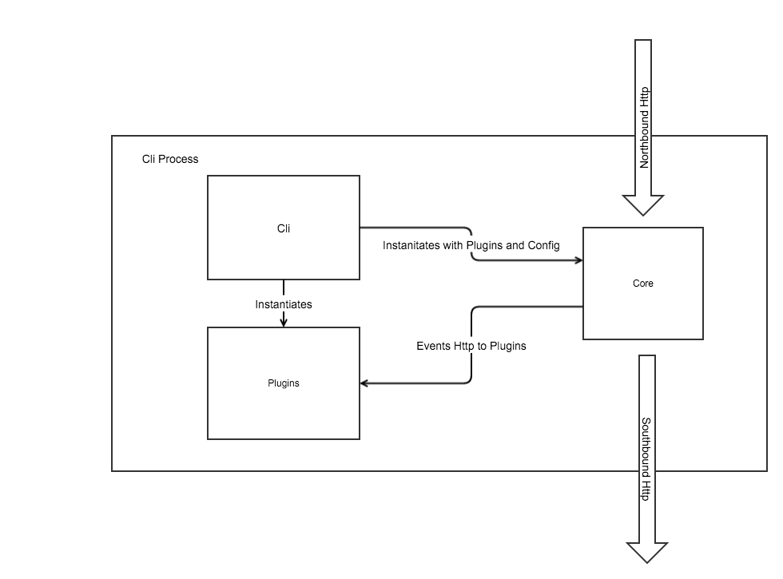
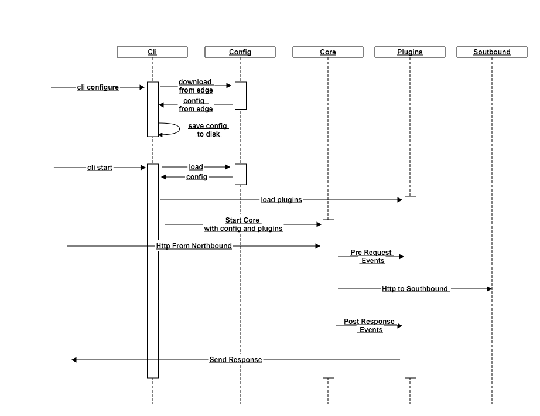

# Apigee Microgateway 

The Apigee Microgateway is a lightweight api proxy that routes requests between northbound and southbound api endpoints. As the requests are routed the microgateway introduces an eventing model that is based on the concept of http middleware.  You can add custom plugins to the http router via the plugins directory.  You can also change the code to explicitly load plugins via the gateway.addPlugin method.  For more information about plugins see [https://github.com/apigee/microgateway-plugins](https://github.com/apigee/microgateway-plugins).
For more information on how to use the producet see the [product documentation](http://docs.apigee.com/microgateway/content/edge-microgateway-home)

The Microgateway is composed of 4 components

* [microgateway-core](https://github.com/apigee/microgateway-core): a lightweight core server that forwards requests and responses between northbound and southbound endpoints.  Core also contains an event model that will call each plugin.    
* [microgateway-config](https://github.com/apigee/microgateway-config): a config module that allows a user to pull down and load yaml configs from Apigee Edge
* [microgateway-plugins](https://github.com/apigee/microgateway-plugins): a file system reference to a collection of directories that allow a user to extend the microgateway.  
* [microgateway-cli](https://github.com/apigee/microgateway-cli): a command line driven runtime that will download the configuration, instantiate the plugins and run the microgateway-core. This component contains knowledge about where things are.  

 
The cli repo instantiates the gateway and loads the configs and the plugins.  Below is the workflow of the cli.  In order to load custom plugins you must load your plugin in the plugins directory.  The plugins directory is configured in the [default.yaml](config/default.yaml) or in the specified config directory.

